<p align="center">
  <a href="https://withceleste.com"></a>
  &nbsp;&nbsp;&nbsp;&nbsp;✕&nbsp;&nbsp;&nbsp;&nbsp;
  <a href="https://cloud.idunplatform.com">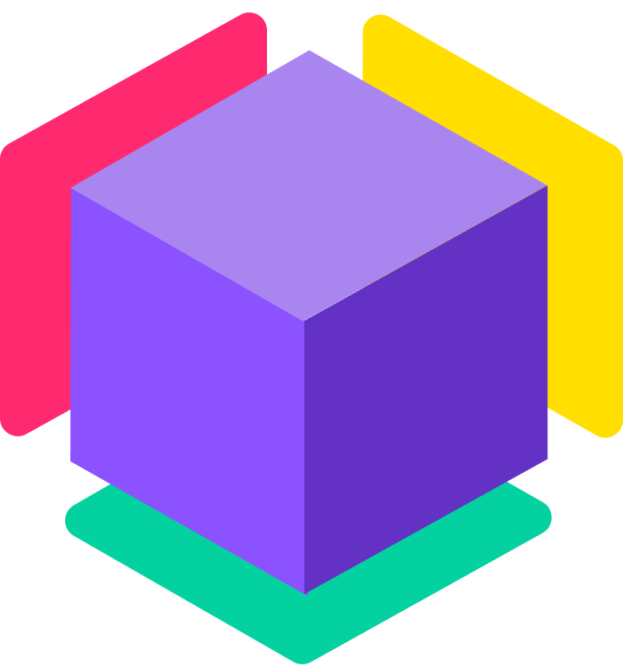</a>
</p>

<h1 align="center">Celeste AI x Idun Agent Platform</h1>

Building agents is not the hard part anymore. The hard part is everything around it. Picking a provider, wiring up their SDK, realizing three weeks later you need a different model, rewriting the integration. Then doing it all again for the infrastructure side. API endpoints, prompt versioning, observability, guardrails. By the time you're done, the actual agent logic is 10% of the codebase.

We built a RAG agent to show how [Celeste AI](https://withceleste.com) and [Idun Agent Platform](https://cloud.idunplatform.com) take those problems off the table.

The source code is on [GitHub](https://github.com/Idun-Group/celeste-rag-agent).

## Celeste AI simplifies the model layer

When you start building an agent, you make a model choice early. Google Gemini for generation, OpenAI for embeddings, maybe Anthropic later. Each provider has its own SDK, its own auth, its own response format. And if you want to swap, you're rewriting integration code.

[Celeste AI](https://withceleste.com) removes that decision from the codebase entirely. It's a Python SDK that gives you one API for text, embeddings, images, video, and audio across every major provider. The provider is a parameter, not a dependency.

Here's what the LLM call looks like in our agent:

```python
response = await celeste.text.generate(
    prompt="...",
    model="gemini-3-flash-preview",
)
```

And here's what switching to Anthropic looks like:

```python
response = await celeste.text.generate(
    prompt="...",
    provider="anthropic",
    model="claude-sonnet-4-5",
)
```

Same function. Same response shape. No new imports, no new client libraries, no changes anywhere else in the code. The embeddings work the same way:

```python
vecs = await celeste.text.embed(
    model="gemini-embedding-2-preview",
    text="...",
    dimensions=768,
)
```

Want to try OpenAI's `text-embedding-3-large` instead? Change the model string. Everything downstream, the vector store, the retrieval, the graph, none of it knows or cares.

This is what we mean by simplifying agent development. You stop writing provider integration code and start writing agent logic.

[Documentation](https://docs.withceleste.com) · [PyPI](https://pypi.org/project/celeste-ai/)

## Idun takes the agent to production

You have a working LangGraph graph. Now what?

You need an API endpoint. A way to manage prompts without redeploying. Observability so you can see what the agent is doing. Guardrails so it doesn't leak PII or go off-topic. Maybe a Slack or Google Chat integration so people can actually reach it. Checkpointing so conversations don't disappear when the server restarts.

That's weeks of work. Or you point [Idun](https://github.com/Idun-Group/idun-agent-platform) at your graph and it's done.

Idun is an open-source platform that wraps LangGraph and Google ADK agents into production services. We used [Idun Cloud](https://cloud.idunplatform.com) for this project, where everything is configured in the browser.

You write your graph, export it as an uncompiled `StateGraph`, and Idun handles the rest. It compiles the graph with the checkpointer you configure, exposes an [AG-UI protocol](https://docs.ag-ui.com) endpoint, and gives you a playground to test from. Prompts are versioned and editable in the UI. Observability plugs into [Langfuse](https://langfuse.com), [Arize Phoenix](https://phoenix.arize.com), or [LangSmith](https://smith.langchain.com). Guardrails are toggleable per agent.

The gap between "my graph works locally" and "people are using this" is where most projects stall. Idun closes it.

[Cloud](https://cloud.idunplatform.com) · [Documentation](https://docs.idunplatform.com) · [GitHub](https://github.com/Idun-Group/idun-agent-platform)

## The agent

To show this in practice, we built a RAG agent that answers HR questions from a set of French PDF documents. Employment contracts, company agreements, telework policies, disciplinary procedures. An employee types a question, the agent finds the relevant documents and answers from them.

The pipeline is three LangGraph nodes:

```
rewrite_query → retrieve → generate
```

`rewrite_query` rewrites the user's question for vector search. This matters because conversational French and formal HR language barely overlap. "Clémence a droit à quoi comme avantages?" becomes "avantages sociaux Clémence Vasseur", which actually matches the right document chunks.

`retrieve` searches the vector store built from the PDFs using Celeste embeddings.

`generate` takes the retrieved chunks and the original question, sends them through Celeste, and returns the answer.

## The code

Three files of application logic.

### state.py

```python
from typing import Annotated, TypedDict
from langchain_core.documents import Document
from langchain_core.messages import AnyMessage
from langgraph.graph import add_messages


class InputState(TypedDict):
    messages: Annotated[list[AnyMessage], add_messages]


class GraphState(InputState):
    rewritten_query: str
    documents: list[Document]
    answer: str


class OutputState(TypedDict):
    answer: str
```

`InputState` has only `messages`, which tells Idun to show a chat interface. `OutputState` has only `answer`, so the response comes back as text.

### celeste_adapter.py

```python
import celeste
from langchain_core.embeddings.embeddings import Embeddings

EMBEDDING_MODEL = "gemini-embedding-2-preview"
EMBEDDING_DIMENSIONS = 768
GENERATION_MODEL = "gemini-3-flash-preview"


class CelesteEmbeddings(Embeddings):
    def embed_documents(self, texts):
        response = celeste.text.sync.embed(
            text=texts,
            model=EMBEDDING_MODEL,
            dimensions=EMBEDDING_DIMENSIONS,
        )
        return response.content

    def embed_query(self, text):
        response = celeste.text.sync.embed(
            text=text,
            model=EMBEDDING_MODEL,
            dimensions=EMBEDDING_DIMENSIONS,
        )
        return response.content

    async def aembed_query(self, text):
        response = await celeste.text.embed(
            text=text,
            model=EMBEDDING_MODEL,
            dimensions=EMBEDDING_DIMENSIONS,
        )
        return response.content

    async def aembed_documents(self, texts):
        response = await celeste.text.embed(
            text=texts,
            model=EMBEDDING_MODEL,
            dimensions=EMBEDDING_DIMENSIONS,
        )
        return response.content


async def call_celeste(prompt):
    response = await celeste.text.generate(
        prompt,
        model=GENERATION_MODEL,
        max_tokens=2048,
        temperature=0.7,
    )
    return response.content
```

This is the entire model layer. Every LLM and embedding call in the agent goes through this small adapter module. If we swap providers, this file is the only thing that changes.

### main.py

```python
from langchain_community.vectorstores import InMemoryVectorStore
from langchain_community.document_loaders.pdf import PyPDFDirectoryLoader
from langchain_core.documents import Document
from langgraph.graph import StateGraph, START, END
from idun_agent_engine.prompts import get_prompt

from state import GraphState, InputState, OutputState
from celeste_adapter import CelesteEmbeddings, call_celeste

REWRITE_PROMPT = get_prompt("rewrite_prompt")
RAG_PROMPT = get_prompt("basic_rag")

store = None


def load_docs(path="docs"):
    loader = PyPDFDirectoryLoader(path)
    return loader.load_and_split()


async def rewrite_query(state):
    question = state["messages"][-1].content
    rewritten = await call_celeste(
        REWRITE_PROMPT.format(question=question)
    )
    return {"rewritten_query": rewritten.strip()}


async def retrieve(state):
    global store
    if store is None:
        docs = load_docs()
        store = await InMemoryVectorStore.afrom_documents(
            docs, CelesteEmbeddings()
        )
    results = await store.asimilarity_search(
        state["rewritten_query"], k=4
    )
    return {"documents": results}


async def generate(state):
    question = state["messages"][-1].content
    context = "\n\n---\n\n".join(
        doc.page_content for doc in state["documents"]
    )
    answer = await call_celeste(
        RAG_PROMPT.format(context=context, question=question)
    )
    return {"answer": answer.strip()}


def build_graph():
    graph = StateGraph(
        GraphState, input=InputState, output=OutputState
    )
    graph.add_node("rewrite_query", rewrite_query)
    graph.add_node("retrieve", retrieve)
    graph.add_node("generate", generate)

    graph.add_edge(START, "rewrite_query")
    graph.add_edge("rewrite_query", "retrieve")
    graph.add_edge("retrieve", "generate")
    graph.add_edge("generate", END)

    return graph


graph = build_graph()
```

Notice what's not here. No API server code. No streaming logic. No prompt storage. No auth. The graph is exported uncompiled, and Idun takes it from there.

Prompts are loaded through `get_prompt()`, which pulls versioned prompts from Idun Cloud. You iterate on them in the UI without touching the code.

## Idun Cloud setup

Navigate to [cloud.idunplatform.com](https://cloud.idunplatform.com) and log in.

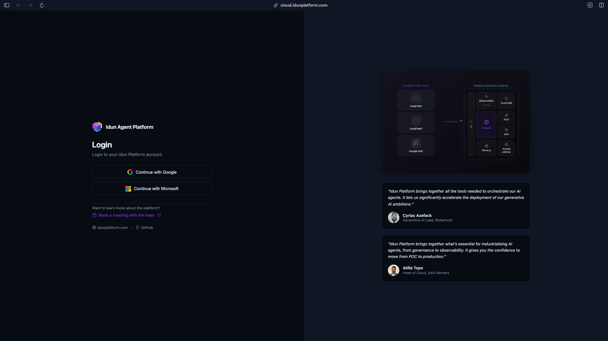

Once logged in, click on the agent pane and create an agent.

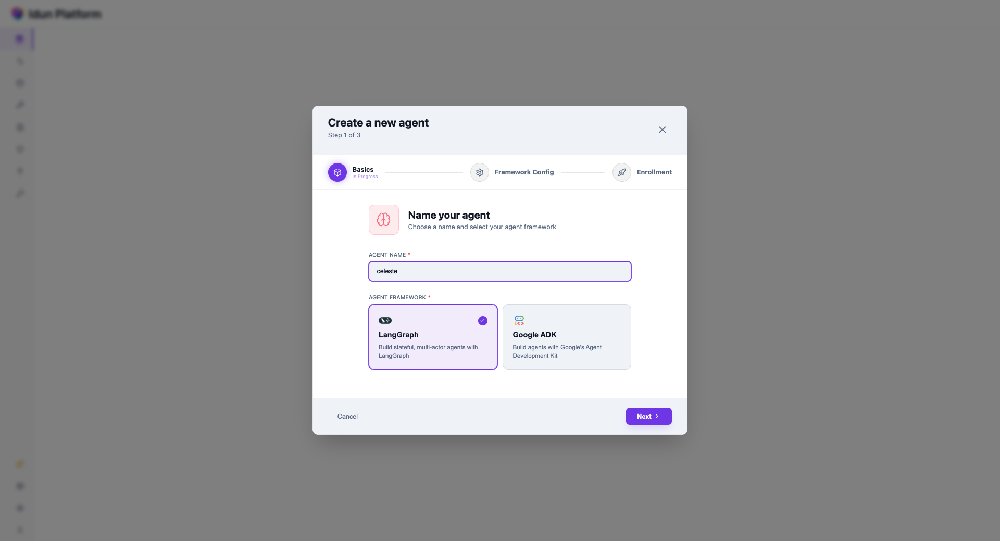

Fill out the graph definition. If you cloned the repo and `cd` into it, you'll find this structure:

```
celeste-rag-agent/
  main.py              # the graph (exports `graph`)
  state.py             # InputState, GraphState, OutputState
  celeste_adapter.py   # CelesteEmbeddings + call_celeste
  docs/                # the HR PDFs
```

The graph definition field tells the engine where to find your `StateGraph`. The format is `path/to/file.py:variable_name`. In our case, the graph is exported as `graph` at the bottom of `main.py`, so the graph definition is:

```
main.py:graph
```

Idun loads this module, finds the uncompiled `StateGraph`, and compiles it with whatever checkpointer you've configured.

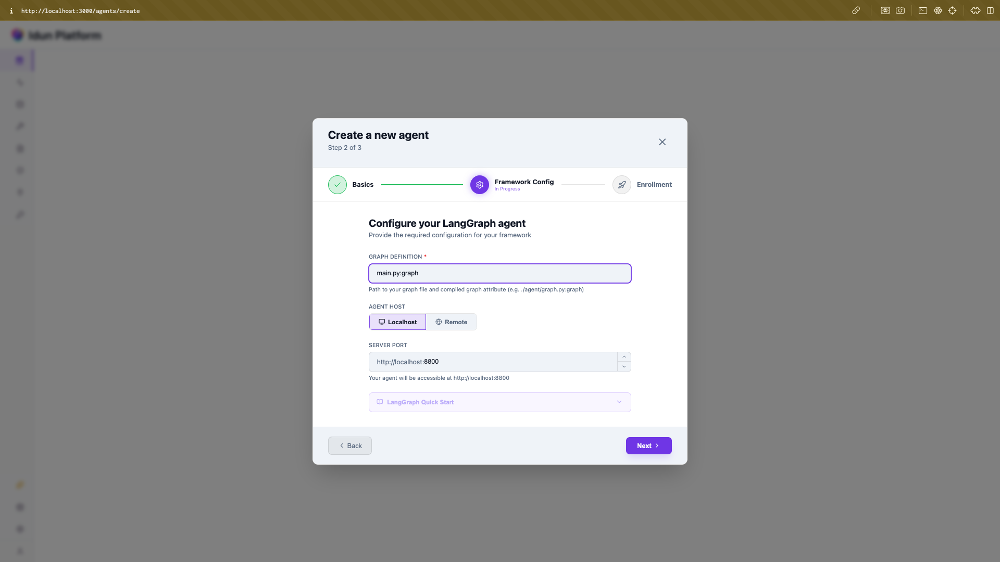

Follow the instructions and click verify to make sure your setup is working and your API is exposed on the configured port.

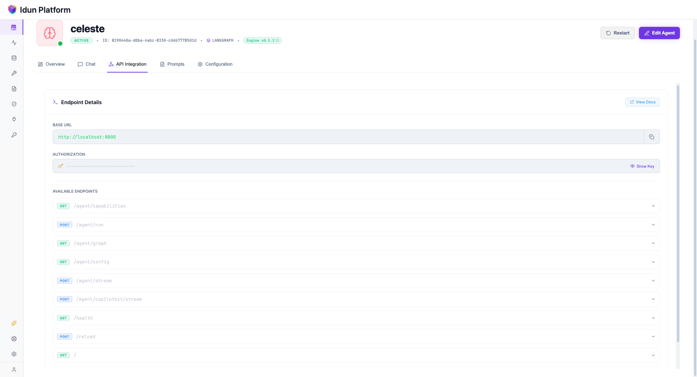

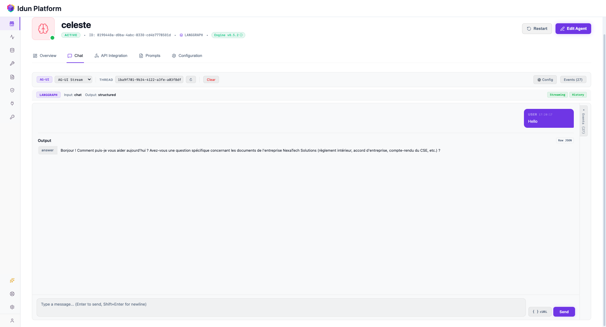

## Prompts

The agent uses two prompts, one for query rewriting and one for generation. They're managed in Idun's prompt editor rather than hardcoded in the source. You can tweak the wording, test a different instruction style, or adjust the system message without redeploying. Each edit is versioned so you can roll back.

Prompts are Jinja templates. You inject runtime variables with `{{ var_name }}` and load them in your code:

```python 
from idun_agent_engine.prompts import get_prompt
prompt = get_prompt("prompt_id")
rendered = prompt.format(var_name="your value")
```

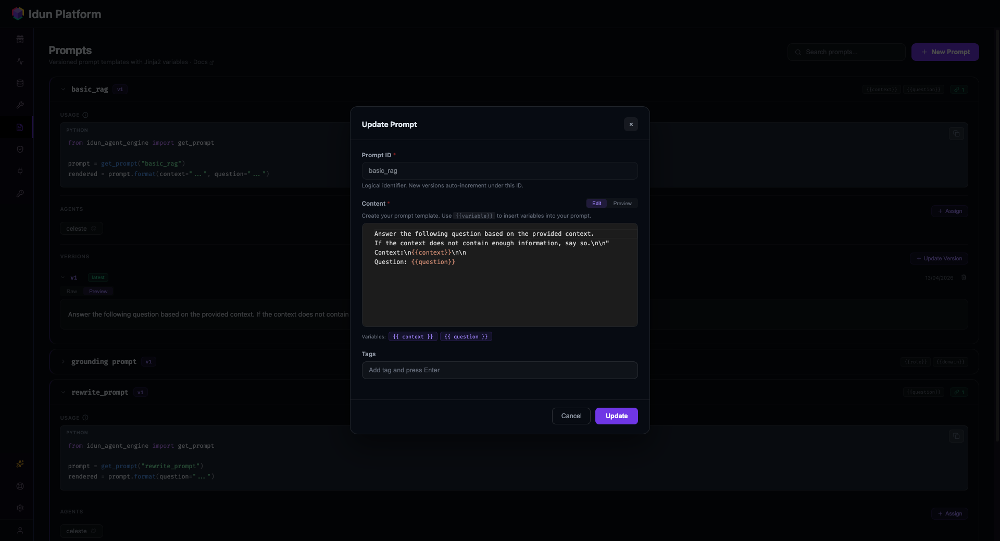

Make sure to assign each prompt to the correct agent. Prompts are agent-scoped, so they won't be available until assigned.

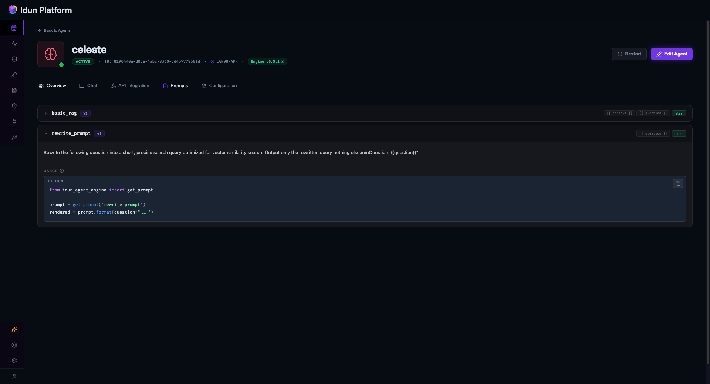

## Guardrails

Since this agent is exposed to employees, you probably don't want them pasting sensitive information into the chat. Social security numbers, bank details, personal addresses. Idun lets you enable PII detection on the input side, so the agent rejects messages containing personal data before they ever reach the LLM.

You can also restrict the agent to stay on topic, so it only answers HR-related questions and doesn't get repurposed as a general chatbot. These are configured per agent in the Idun Cloud UI, no code changes.

To set this up, get your API key from [Guardrails AI](https://guardrailsai.com). Then go to the Guard page in Idun Cloud and create a PII detection guard.

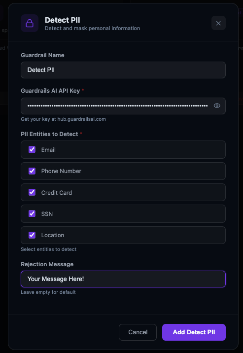

Assign the guardrail to your agent and click reload.

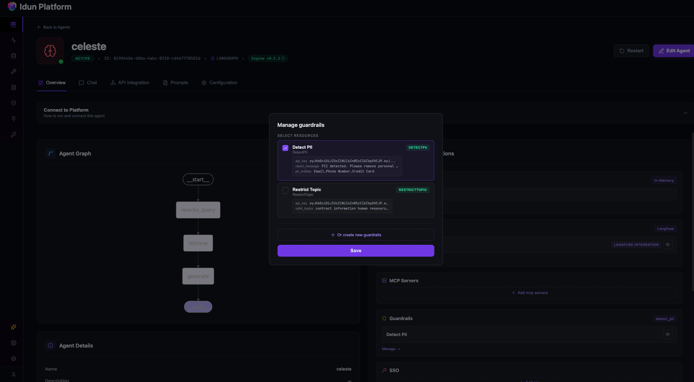

You can verify it works from the playground.

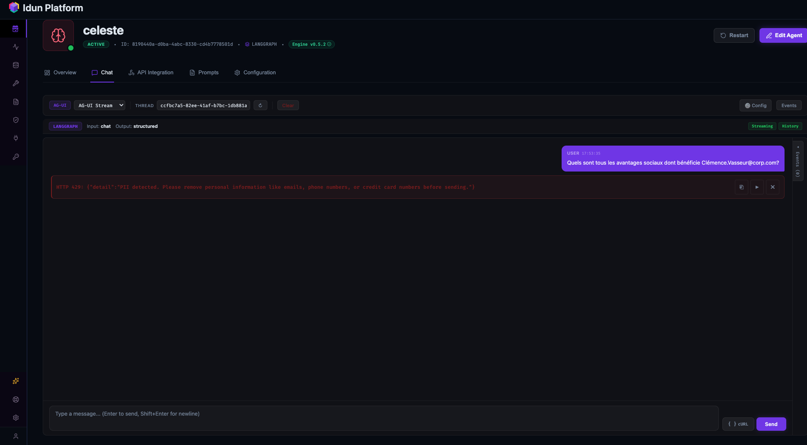

## In action

We asked "Quels sont tous les avantages sociaux dont bénéficie Clémence Vasseur?"

The agent cross-referenced her CDI contract and the 2024-2027 company agreement and returned the full list. Mutuelle at 65% employer-covered, prevoyance at 100% for cadres, 10-euro meal vouchers, telework allowance, equipment budget, mobility budget, RTT days, sick-child days, extended paternity leave at full salary. All pulled from the source documents.

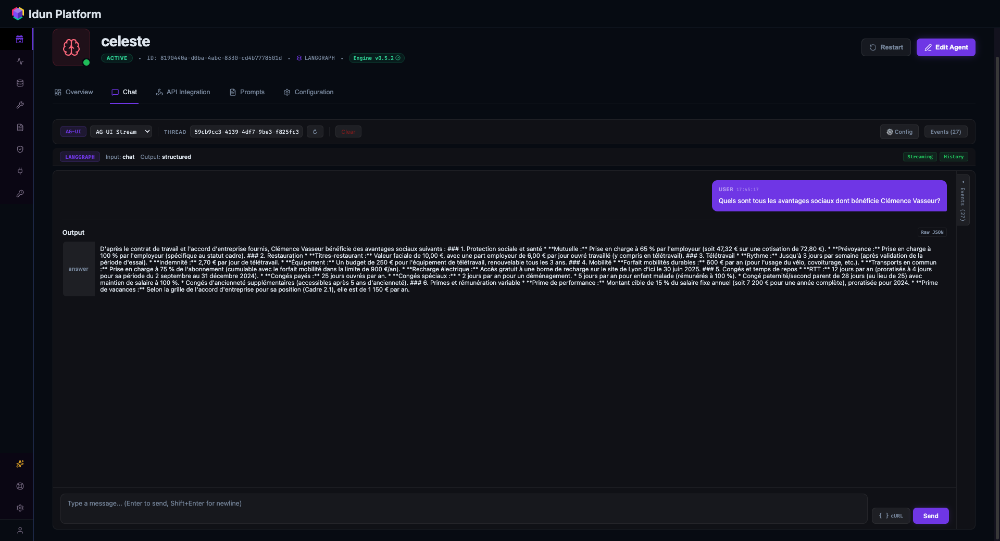

## Conclusion

The point of this project wasn't the RAG pipeline itself. RAG is a well-understood pattern. The point was how little friction there was in building and deploying it.

Celeste meant we didn't write any provider-specific code. The model layer is a small adapter module. When we want to evaluate a different model, we change a string and run the agent again. No migration, no new SDK, no refactoring.

Idun meant we didn't build any infrastructure. The same graph that works locally is the one running in production, with prompts managed in the UI, observability plugged in, and an API endpoint ready for frontends or messaging integrations.

The agent itself is three files of actual logic. Everything else is handled.

Try it yourself with [Celeste AI](https://pypi.org/project/celeste-ai/) and [Idun Cloud](https://cloud.idunplatform.com). The source code is on [GitHub](https://github.com/Idun-Group/celeste-rag-agent).
